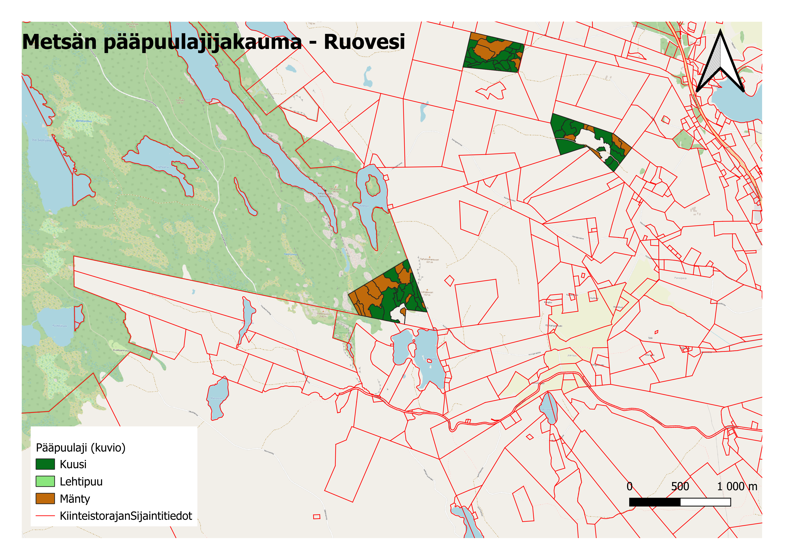

# metsatilat

# Metsävarojen hallinta ja spatiaalinen analyysi - Ruovesi

## Keskeiset tekniset ratkaisut
- **PostGIS-näkymät:** Luotu dynaamisia SQL-näkymiä, jotka luokittelevat ja suodattavat metsävaratietoa reaaliajassa.
- **Spatiaaliset leikkaukset:** Käytetty `ST_Intersection`-funktiota varmistamaan, että metsäkuviot noudattavat tarkasti kiinteistörajoja.

## Projektin rakenne
- `sql_scripts/`: Sisältää dynaamisten näkymien luontiin käytetyt SQL-lauseet.
- `project_files/`: QGIS-projektitiedosto visualisointeineen.
- `screenshots/`: Visuaalinen esitys lopputuloksesta.

## Visualisointi

---
*Teknologiat: QGIS 3.44.7, PostgreSQL/PostGIS, SQL, Git.*
